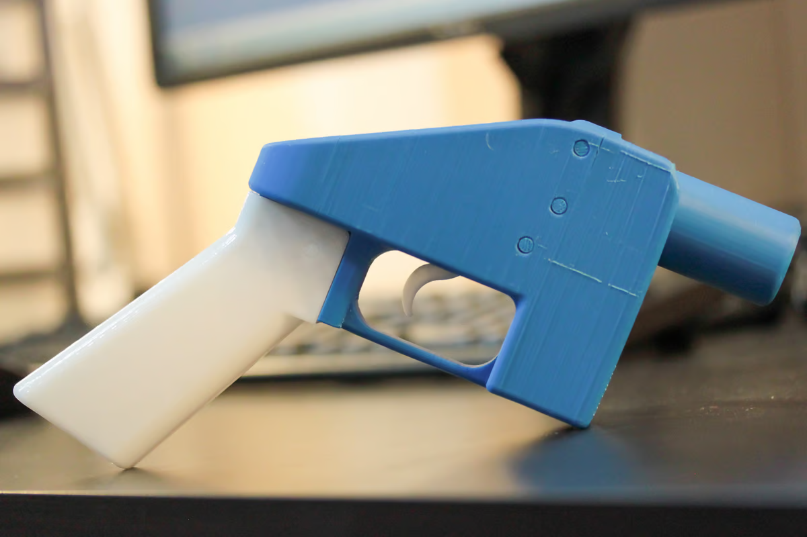

TEST TEST TEST TEST 

today i am trying to figure out exactly how to use FOAM and my note taking . for now i will just dump any info i am working on today . 

-3d print outline 

-begin with capabilities of design polymers 

-describe different models  ( show pictures )

-describe where/ how they are being use today 

-future 

------END OF OUTLINE-----------END OF OUTLINE-----------END OF OUTLINE-----------END OF OUTLINE-----------END OF OUTLINE-----------END OF OUTLINE-----------END OF OUTLINE-----

-----------sources and general info -----------------------sources and general info ------------

[The atf has produced a very useful recourse for U.S citizens wanting to learn about the legality of 3d printed firearms.](https://www.atf.gov/qa-category/3-d-printing-technology-firearms)

the first 3d printed firearms hit the general public in the early 2000s as new possibilities were now possible from desktop 3d printers and cad files. affordability and a can do engenering spirit eventually led to the "liberator" a single shot .45 acp pistol as pictured below. 

that same year a company called SOLID CONCEPTS created a replica of a colt 1911 using a direct metal laser sintering printing process. 

https://www.youtube.com/watch?v=auAqg-FiHv4 - video about orca a 3d printed rifle. 

