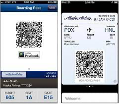

oh it was quite the day for me. I have the collector bug. when i see something i want i need it i have to have it i cant wait. you understand its all about me in that moment. this time it was Chungwha 

I have looked everywhere in my area and i could not find them. Apparently its illegal big tobacco in america does not want to compete with china. They have 4-5 fake chinese websites run by real asians waiting to get that sweet $usd. FUCK THAT. I found you can have them shipped to you through various companies in the airport. Eventually i found the Dufry store was selling them by the carton. 

(test1.png)
I was able to get an airport pas to get into the terminals. I had to straight up go through TSA and ge my balls rubbed up on by some perv. Im sure no many people go to the airport for cigarettes so i thought maybe they had me on a list. lol (i have a wild search history) I finally make it to thought all the bullshit shit to be told at the counter they needed to see my boarding pass. I almost roped right there. I thought i would be able to find someone to buy me them but i guess evading taxlaws within a crowd of uniforms is pretty sketch.

 Okay so here is the low point 
 i actually got to the point where i decided i could just trick the dumb asian lady behind the dufry. I mean she could barely speak english there is now way she would know whats up....... but then i bitched up. maybe because i saw from a quick search they scan your boarding pass so my bullshit screenshot was more than a joke . maybe illegal, I don't even smoke cigarettes. I decided fuck it ill buy a flight to canada one way grab the boarding pass and boom i could practaclly hear the cracked cellophane. I saw the ticket was $500 pretty steep. I look at flights to mexico and i was saving 200$ no shit. the distance to mexico is way farther. Anyway i call the airline and tell them i just grabbed a ticket for a plane leaving it 12 hours (that felt cool) after an annoying 20 min i find out that i cant get a boarding pass without my passport. so i wasted 3-4 hours at the airport today. It could have been worse. could have been better but at the end of the day it happened.

 what i got done

 the base exocore is complete and ready to be forked. I am sure there are some things i could do like add less ME photos on there but this is way better than the base remilia exocore. 

 i created the web3 tv website along with the imagery  i was able able to create a rss scraper that will auto update my website one time a day if there is a new episode 

 ive noticed my logging functions are not really working which coild be helpful as rigt now my bot doesnt pick up on the rss feed url. i feel there may not be an i age in the rss feed and thats why only spotify has photos. ill spend 2-3 hors on this. becase my website is just for web3 tv i need to remove 90% of webnpages or at least reporpuse. i will ponder this.