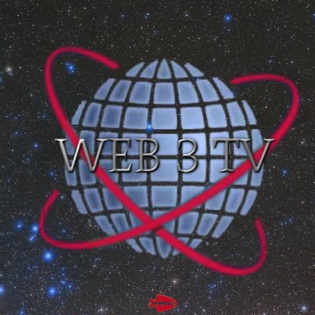

 ## WEB 3 TV

  was a daily podcast that ran for over 8 months, giving listeners an aggregation of the best and most fake stories of the day from the perspective of a chronically online cryptocurrency gambler who has a passion for guessing the valuation of assets. 

## Substack

[substack](https://open.substack.com/pub/cmoney/p/autumn-is-for-airdrops?r=cpxah&utm_campaign=post&utm_medium=web)
I think this website is my substack now the the space is still cool. 

## REGALbLITZ.US

[Regalblitz.us](regalblitz.us) <strong> is the best United states based supplement supplier. That is a pretty bold claim but the team is large and decentralized. OUR genesis product is extracted from the fresh pines in remote alaskan mountains MAY through SEPTEMBER placed in Glass bottles and shipped to your door FAST. On the site you will find a form for yourself to become a sales terrorist with us. The future of your fate is only in your hands. </strong> 

## PRAYER

{:.center}
God grant me  serenity,
Help me accept the things I cannot change.
The courage to change the things I can,
And the wisdom to know the difference.
Living one day at a time.
Enjoying one moment at a time.
Accepting hardship as a pathway to peace.
Taking,  this sinful world as it is,
Not as I would have it.
Trusting that You will make all things right,
If I surrender to Your will;
So that I may be reasonably happy in this life,
And supremely happy with You forever in the next.

Amen

## TBD 

## Information Pipeline

- **Daily Notes**, designed as a quick access scratch pad, and are perfect for low-specificity research dumps and fleeting notes that will inform your notes in future. These are automatically titled by date. One is created each day automatically, and opened when you open VSCode.
- **Wiki Notes**, designed for single atomic data points, and are automatically titled with a hexadecimal color code. This code is turned into a correspondingly colored badge in the index of the published site.
- **Journal Entries**, for your thoughts, and are not automatically titled.
- **Articles**, for longer write-ups on a particular topic.

These note categories together create a pipeline for systematising knowledge over time from the general to the particular, and for capturing a bank of scattered reference material and developing it into a polished final product. For example, you might choose to cite a research dump in the subsequent post that it turned into as a bibliography/further reading section. This workflow is designed to encourage active, daily use of the exocore for all thoughts.

 // i need to put this info below here in a footer and some sections above could get a promtpt box or glow Syntax ect.  
 
## Full Tech Stack

- [Obsidian](https://obsidian.md) / [VS Code](https://code.visualstudio.com) (and plugin package)
- [Git](https://git-scm.com) (for syncing)
- [Jekyll](https://jekyllrb.com) (for publishing)

**Obsidian Plugins:**
- Backlinks
- Daily Notes
- Templates
- [Obsidian Git](https://github.com/denolehov/obsidian-git)
- [Templater](https://github.com/SilentVoid13/Templater)
- [Filename Heading Sync](https://github.com/dvcrn/obsidian-filename-heading-sync)

**VSCode Plugins:**
- [Foam](https://marketplace.visualstudio.com/items?itemName=foam.foam-vscode)
- [Netlify](https://marketplace.visualstudio.com/items?itemName=shailen.netlify)
- [Markdown All in One](https://marketplace.visualstudio.com/items?itemName=yzhang.markdown-all-in-one)
- [Paste Image](https://marketplace.visualstudio.com/items?itemName=mushan.vscode-paste-image)
- [Spell Right](https://marketplace.visualstudio.com/items?itemName=ban.spellright)

[[TBD2#Using Metadata|metadata section]]

[//begin]: # "Autogenerated link references for markdown compatibility"
[TBD2#Using Metadata|metadata section]: _articles/TBD2 "TBD2"
[//end]: # "Autogenerated link references"